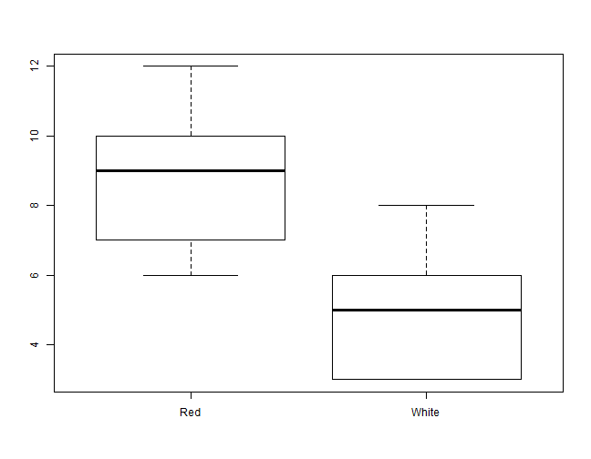
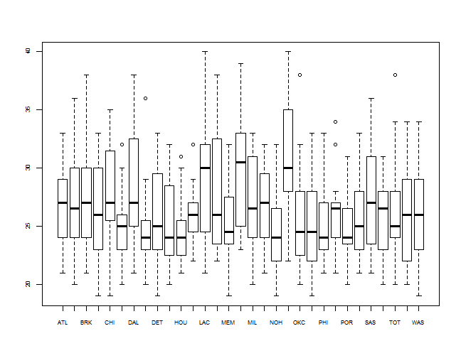
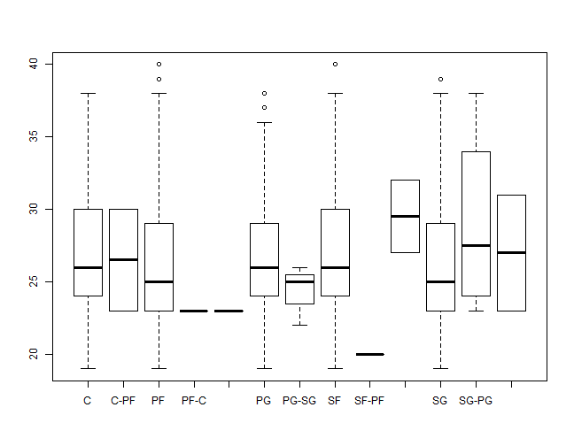
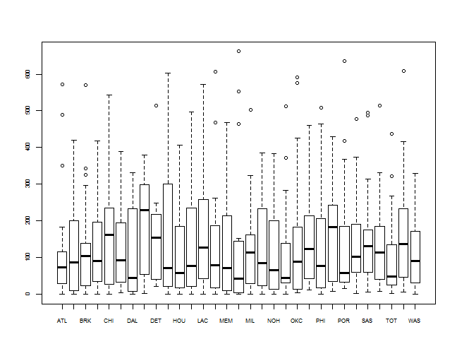

An introduction to R
======================================

We are awash in a sea of data.  Every thing that is measured, valued, bought, sold, studied brings with it more and more data.  The things we use every day, computer programs and apps generate megabytes, gigabytes and terrabytes of data every day.  Widely used programs like Twitter contains an enormous amount of data.  Millions of tweets are generated every day on thousands of topics.  They include personal messages, critical information, political statements, humor and images.

We can use this information to help make sense of the world around us if we ask the right questions, use the right tools, and understand a bit about the system we are trying to study.  In this way data science is no different from any of the other sciences.  We need to understand something about the data before we can make sense of it.  In some ways using twitter lowers the barrier because twitter users are not paramecium, rare-earth metals or neutron stars, they are our friends, relatives and neighbors.

To begin to use Twitter as a data source we need to find a way to interact with the program ([http://twitter.com]()) and a way to modify and present the data.  The statistical software R is rapidly becoming popular in the sciences, and people who can use R with some competence are highly valued in the workforce.  One of the benefits of R is that it is incredibly flexible.  

The program itself has a set of basic functions that can be used to do some simple analysis, like take the mean of a set of values:


```r
values <- c(10, 20, 30, 40, 50)
mean(values)
```

```
## [1] 30
```

Here we have created a vector of values by 'concatenating' using the function `c`.  After this we take our variable (a set of numbers) and use it in the function `mean`.

With R we can do all sorts of simple 'scripting', where we enter variables manually and examine them, for example we can use a more complex data structre, called a `data.frame` to look at the differences between red and white cars:


```r
car.speeds <- data.frame(color = c('Red', 'White', 'White', 
                                   'White', 'Red', 'Red', 'White', 'Red', 'Red',
                                   'White'),
                         speed = c(10, 3, 8, 6, 12, 9, 3, 6, 7, 5))

boxplot(speed ~ color, data = car.speeds)
```

 

Here we see a function `data.frame` that creates a data object containing two other variables, `color`, a set of strings that we concatenate, and `speed`, a set of numbers that we concatenate.

Then we use the function `boxplot`.  `boxplot` takes a formula, and asks what data the formula is based on.  Here the formula says to plot a boxplot where speed is on the y axis and color is on the x axis.

All of this is fairly simple.  You can type it out yourself, but one of the strengths of R is that it can do these same operations on hundreds, or thousands of datasets by taking inputs from other sources.

Here we're going to look at NBA data from 2013. I downloaded the data from [here](http://www.basketball-reference.com/leagues/NBA_2013_totals.html), you'll find that there are lots of great places to find data online once you start looking.

There are 573 player entries, it's a big data set and I don't want to enter it myself. So we can take the data from the website and load it directly into R.  There are lots of ways to input and output data into R, and, as you explore more datasets you'll see there are lots of different data formats.  A good resource comes from the University of Notre Dame [here](http://www3.nd.edu/~sjones20/JonesUND/BioStats_files/Rinput%26output_1-15-13.pdf).

We're going to load the data, but first, take a look at it yourself by going [here]().   What sorts of variables do you see?  What's an interesting thing to look at?


```r
nba.data <- read.csv('data/nba_totals_2013.csv', stringsAsFactors = TRUE)

# Average age by team:
boxplot(Age ~ Tm, data = nba.data, cex.axis = 0.7)
```

 

```r
boxplot(Age ~ Pos, data = nba.data)
```

 

```r
boxplot(X2P ~ Tm, data = nba.data, cex.axis = 0.7)
```

 

So we've done some basic analysis with R.  Let's look at another way of getting data.
